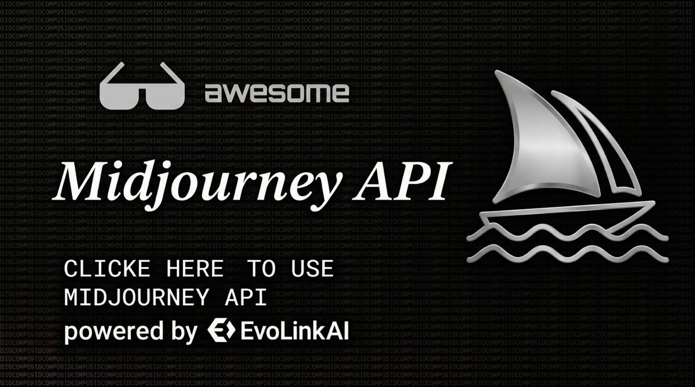

# Midjourney API: V8.1 및 V7 문서, 워크플로우, 통합 예제

<p align="center">
  <a href="./README.md">English</a> · <a href="./README.es.md">Español</a> · <a href="./README.pt.md">Português</a> · <a href="./README.ja.md">日本語</a> · <a href="./README.ko.md">한국어</a> · <a href="./README.de.md">Deutsch</a> · <a href="./README.fr.md">Français</a> · <a href="./README.tr.md">Türkçe</a> · <a href="./README.zh-TW.md">繁體中文</a> · <a href="./README.zh-CN.md">简体中文</a> · <a href="./README.ru.md">Русский</a>
</p>

<p align="center">
  <a href="https://docs.evolink.ai/en/api-manual/image-series/midjourney/mj-v8-1-image-generate?utm_source=github&utm_medium=banner&utm_campaign=midjourney-api">
    
  </a>
</p>

<p align="center">
  EvoLink로 최신 Midjourney V8.1 이미지 생성 워크플로우를 통합하고, 기존 통합을 위한 V7 문서도 보존합니다.
</p>

<p align="left">
  <a href="https://docs.evolink.ai/en/api-manual/image-series/midjourney/mj-v8-1-image-generate?utm_source=github&utm_medium=readme&utm_campaign=midjourney-api">V8.1 이미지 생성 문서 읽기</a> ·
  <a href="https://docs.evolink.ai/en/api-manual/image-series/midjourney/midjourney-v8-1-prompt-guide?utm_source=github&utm_medium=readme&utm_campaign=midjourney-api">V8.1 프롬프트 가이드 읽기</a> ·
  <a href="https://evolink.ai/signup?utm_source=github&utm_medium=readme&utm_campaign=midjourney-api">API 키 받기</a>
</p>

## EvoLink 빠른 시작

한 번의 API 호출로 Midjourney V8.1 이미지 생성을 사용합니다.

```bash
export EVOLINK_API_KEY="your_key_here"

curl --request POST \
  --url https://api.evolink.ai/v1/images/generations \
  --header "Authorization: Bearer ${EVOLINK_API_KEY}" \
  --header 'Content-Type: application/json' \
  --data '{
    "model": "mj-v8.1",
    "prompt": "A cinematic shot of a Maine Coon cat on a neon-lit balcony --ar 16:9 --s 500",
    "quality": "standard",
    "model_params": {
      "speed": "fast"
    }
  }'
```

## 첫 실행 전체 흐름

Midjourney 생성과 편집은 비동기 작업입니다. 프로덕션 통합에서는 작업을 만들고, 작업 ID를 저장하고, 폴링 또는 callback으로 완료를 확인한 뒤 최종 이미지 URL을 만료 전에 저장해야 합니다.

```bash
export EVOLINK_API_KEY="your_key_here"
bash examples/curl/complete-flow.sh
```

전체 예제:

- [cURL complete flow](./examples/curl/complete-flow.sh)
- [Python complete flow](./examples/python/complete_flow.py)
- [JavaScript complete flow](./examples/javascript/complete-flow.mjs)
- [cURL V8.1 generation](./examples/curl/generate-image-v8-1.sh)
- [JavaScript V8.1 generation](./examples/javascript/basic-v8-1.mjs)

## Midjourney API란?

EvoLink.ai의 Midjourney API는 하나의 API 키로 Midjourney 이미지 생성 및 편집 워크플로우에 접근할 수 있게 해 줍니다. 이 저장소는 최신 Midjourney V8.1 생성 제품군을 다루면서, V7 모델 ID에 의존하는 기존 통합을 위해 V7 워크플로우 참고 자료도 보존합니다.

이 저장소는 다음을 원하는 개발자를 위한 것입니다:

- Midjourney V8.1 이미지 생성을 프로덕션 앱에 통합
- V8.1의 속도, 품질, 프롬프트 파라미터, workflow 동작 이해
- 마이그레이션 중에도 V7 예제 유지
- 생성, variation, remix, 편집, retexture, 배경 제거에 맞는 작업 선택

## Midjourney API에 EvoLink를 사용하는 이유

- 하나의 API 키로 Midjourney V8.1과 보존된 V7 예제 사용
- 프로덕션 통합을 위한 비동기 작업 흐름
- 최상위 `quality` 필드를 통한 V8.1 네이티브 HD 출력
- `model_params.speed`를 통한 V8.1 속도 제어
- Midjourney 네이티브 프롬프트 파라미터와 참조 워크플로우 지원
- 작업 완료 워크플로우용 HTTPS callback 지원

## Midjourney V8.1 가격 참고

V8.1 공식 문서는 속도와 품질 배율로 과금을 설명합니다. 이 저장소는 V8.1의 고정 달러 가격을 임의로 만들지 않습니다.

| 설정 | 값 | 과금 참고 |
|---|---|---|
| `model_params.speed` | `draft`, `fast`, `turbo` | `draft` / `fast` = 1x; `turbo` ≈ 2x |
| `quality` | `standard`, `hd` | `standard` = 1x; `hd` = 1.5x |
| 조합 비용 | speed x quality | `turbo` + `hd` ≈ 3x |

> V8.1 `draft`는 한 번에 가벼운 0.5K 스케치 24장을 반환하며 `quality: "hd"`와 함께 사용할 수 없습니다. fast와 turbo는 생성당 4장을 반환합니다.

## 보존된 Midjourney V7 생성 가격

| 모델 | 모드 | 속도 | 가격 | 참고 |
|---|---|---|---:|---|
| `mj-v7` | 이미지 생성 | draft | $0.040 / 요청 | 약 2.7 크레딧; 요청당 4장 |
| `mj-v7` | 이미지 생성 | fast | $0.079 / 요청 | 기본 모드; 약 5.4 크레딧 |
| `mj-v7` | 이미지 생성 | turbo | $0.159 / 요청 | 우선 모드; 약 10.8 크레딧 |

## 최신 Midjourney V8.1 워크플로우

| 워크플로우 | 모델 | 요약 |
|---|---|---|
| 이미지 생성 | `mj-v8.1` | V8.1 prompt 문법, `quality`, `speed`를 사용하는 text-to-image / 이미지-이미지 |
| 변형 | `mj-v8.1-variation` | 완료된 V8.1 작업에서 subtle 또는 strong 변형 생성 |
| Remix | `mj-v8.1-remix` | 필수 새 prompt로 완료된 결과 재해석 |
| Retexture | `mj-v8.1-retexture` | 입력 이미지 URL에서 직접 texture/style 변경 |
| Upload Paint | `mj-v8.1-upload-paint` | 업로드 이미지, mask, 위치 필드 기반 고급 캔버스 편집 |
| Canvas Edit | `mj-v8.1-edit` | 기존 task 이미지를 canvas에 재배치하고 빈 영역 채우기 |
| 배경 제거 | `mj-v8.1-remove-bg` | prompt나 speed 없이 입력 이미지 URL의 배경 제거 |

## 보존된 Midjourney V7 워크플로우

| 워크플로우 | 모델 | 요약 |
|---|---|---|
| 이미지 생성 | `mj-v7` | V7 텍스트-이미지 / 이미지-이미지 |
| Upscale | `mj-v7-upscale` | 선택한 이미지 업스케일 |
| Inpaint | `mj-v7-inpaint` | 마스크 영역 편집 |
| Outpaint | `mj-v7-outpaint` | 이미지 경계 밖으로 확장 |
| Pan | `mj-v7-pan` | 한 방향으로 확장 |
| Remix | `mj-v7-remix` | 새 prompt로 재해석 |
| Retexture | `mj-v7-retexture` | 구조를 유지하며 texture/style 변경 |
| Canvas Edit | `mj-v7-edit` | 이미지 재배치 및 빈 영역 채우기 |
| Enhance | `mj-v7-enhance` | 선택한 결과 개선 |
| 배경 제거 | `mj-v7-remove-bg` | 투명 배경 피사체 컷아웃 |
| Upload Paint | `mj-v7-upload-paint` | 업로드, 마스크, 캔버스 고급 편집 |

## 공식 API 문서

상세 workflow 참고는 별도 문서에 두어 README는 탐색, 가격 참고, 통합 안내에 집중합니다.

최신 V8.1 문서:

- [V8.1 이미지 생성](./docs/official-api/v8-1-image-generation.md)
- [V8.1 변형](./docs/official-api/v8-1-variation.md)
- [V8.1 Remix](./docs/official-api/v8-1-remix.md)
- [V8.1 Retexture](./docs/official-api/v8-1-retexture.md)
- [V8.1 Upload Paint](./docs/official-api/v8-1-upload-paint.md)
- [V8.1 Canvas Edit](./docs/official-api/v8-1-canvas-edit.md)
- [V8.1 배경 제거](./docs/official-api/v8-1-remove-background.md)
- [프롬프트 파라미터](./docs/prompt-parameters.md)

보존된 V7 문서:

- [V7 이미지 생성](./docs/official-api/image-generation.md)
- [V7 이미지-이미지 및 참조](./docs/official-api/image-to-image-and-reference.md)
- [V7 Upscale](./docs/official-api/upscale.md)
- [V7 Inpaint](./docs/official-api/inpaint.md)
- [V7 Outpaint](./docs/official-api/outpaint.md)
- [V7 Pan](./docs/official-api/pan.md)
- [V7 Remix](./docs/official-api/remix.md)
- [V7 Retexture](./docs/official-api/retexture.md)
- [V7 Canvas Edit](./docs/official-api/canvas-edit.md)
- [V7 Enhance](./docs/official-api/enhance.md)
- [V7 배경 제거](./docs/official-api/remove-background.md)
- [V7 Upload Paint](./docs/official-api/upload-paint.md)

## 프롬프트 파라미터 개요

Midjourney V8.1은 `prompt` 안의 네이티브 파라미터 문법을 지원하지만, 속도와 출력 품질은 API 필드입니다.

| 제어 항목 | 설정 위치 | 값 |
|---|---|---|
| 속도 | `model_params.speed` | `draft`, `fast`, `turbo` |
| 출력 품질 | 최상위 `quality` | `standard`, `hd` |
| 프롬프트 파라미터 | `prompt` | `--ar`, `--c`, `--seed`, `--s`, `--exp`, `--raw`, `--iw`, `--sref`, `--sw`, `--oref`, `--ow` |

V8.1의 이 경로에서는 `--q`, `--no`, `--weird`, `--tile`, `--sv`, `--stop`, `--cref`, `--cw`, `--relax`, `--repeat`, `--p`, 순열, public/stealth 플래그, `--niji`, multi-prompt `::`가 노출되지 않습니다.

## 통합 흐름

1. EvoLink.ai API 키
2. `POST /v1/images/generations`
3. 작업 ID 저장
4. `GET /v1/tasks/{task_id}` 폴링 또는 callback 사용
5. 만료 전에 최종 이미지 URL 저장

## 코드 예제

최신 V8.1 예제:

- [cURL: V8.1 generation](./examples/curl/generate-image-v8-1.sh)
- [JavaScript: V8.1 generation](./examples/javascript/basic-v8-1.mjs)

보존된 V7 예제:

- [cURL: 첫 실행 전체 흐름](./examples/curl/complete-flow.sh)
- [cURL: 기본 생성](./examples/curl/generate-image.sh)
- [cURL: 이미지-이미지](./examples/curl/image-to-image.sh)
- [cURL: upscale](./examples/curl/upscale.sh)
- [cURL: inpaint](./examples/curl/inpaint.sh)
- [Python: 첫 실행 전체 흐름](./examples/python/complete_flow.py)
- [JavaScript: 첫 실행 전체 흐름](./examples/javascript/complete-flow.mjs)
- [JavaScript: 기본 생성](./examples/javascript/basic.mjs)
- [JavaScript: 이미지-이미지](./examples/javascript/image-to-image.mjs)
- [JavaScript: upscale](./examples/javascript/upscale.mjs)
- [JavaScript: inpaint](./examples/javascript/inpaint.mjs)

## 워크플로우 비교

| 필요한 경우 | 권장 workflow | 이유 |
|---|---|---|
| 최신 생성 | `mj-v8.1` | 최신 V8.1 모델 |
| 빠른 스케치 | `mj-v8.1` + `speed: "draft"` | 가벼운 0.5K 스케치 24장 |
| HD 출력 | `mj-v8.1` + `quality: "hd"` | native HD 출력 |
| 변형 | `mj-v8.1-variation` | subtle / strong 변형 |
| prompt 재해석 | `mj-v8.1-remix` | 원본 구조를 유지한 새 prompt |
| 캔버스 편집 | `mj-v8.1-edit` | 재배치하고 빈 영역 채우기 |
| 업로드 이미지 편집 | `mj-v8.1-upload-paint` | 마스크 및 캔버스 workflow |
| 배경 제거 | `mj-v8.1-remove-bg` | prompt 또는 speed 필드 없음 |
| 기존 V7 흐름 | V7 模型 | 호환성 보존 |

## 프로덕션 참고 사항

- Bearer token 인증
- 비동기 작업
- callback은 HTTPS만 가능하며 사설 IP URL은 허용되지 않음
- callback timeout 10초, 최대 3회 재시도
- 공식 문서 기준 V8.1 이미지 링크는 30일 유효
- `model_params.speed`가 속도를 제어
- 최상위 `quality` 控制输出分辨率
- `draft`는 스케치 24장을 반환하며 `quality: "hd"`와 호환되지 않음
- `mj-v8.1-remove-bg` 只接受 `model` 和 `image_urls`
- V7 문서와 예제는 호환성을 위해 보존됨

## FAQ

### 새 Midjourney API 통합에는 어떤 모델을 써야 하나요?
보존된 V7 workflow가 꼭 필요한 경우가 아니라면 새 이미지 생성에는 `mj-v8.1`을 사용하세요.

### V8.1 HD 출력은 어떻게 켜나요?
최상위에 `"quality": "hd"`를 설정하고 `model_params.speed`는 `fast` 또는 `turbo`로 사용하세요. `hd`와 `draft`는 함께 쓰지 마세요.

### prompt에 `--turbo`, `--draft`, `--hd`를 쓸 수 있나요?
아니요. 속도는 `model_params.speed`, 출력 품질은 최상위 `quality`로 제어합니다.

### V7 예제를 계속 사용할 수 있나요?
예. V7 문서와 예제는 기존 통합을 위해 의도적으로 보존되어 있습니다.

## 관련 링크

- [Midjourney V8.1 이미지 생성 Docs](https://docs.evolink.ai/en/api-manual/image-series/midjourney/mj-v8-1-image-generate?utm_source=github&utm_medium=readme&utm_campaign=midjourney-api)
- [Midjourney V8.1 Prompt Guide](https://docs.evolink.ai/en/api-manual/image-series/midjourney/midjourney-v8-1-prompt-guide?utm_source=github&utm_medium=readme&utm_campaign=midjourney-api)
- [Preserved Midjourney V7 이미지 생성 Docs](https://docs.evolink.ai/en/api-manual/image-series/midjourney/mj-v7-image-generate?utm_source=github&utm_medium=readme&utm_campaign=midjourney-api)
- [API 키](https://evolink.ai/signup?utm_source=github&utm_medium=readme&utm_campaign=midjourney-api)

## 저장소 참고

이 저장소는 EvoLink.ai에서 Midjourney API를 사용하기 위한 문서와 예제 허브입니다. 자세한 공식 workflow는 `docs/official-api/`에 정리되어 있으며, `mjv7参考/`는 로컬 참고 자료로 남고 `.gitignore`를 통해 업로드에서 제외됩니다.
