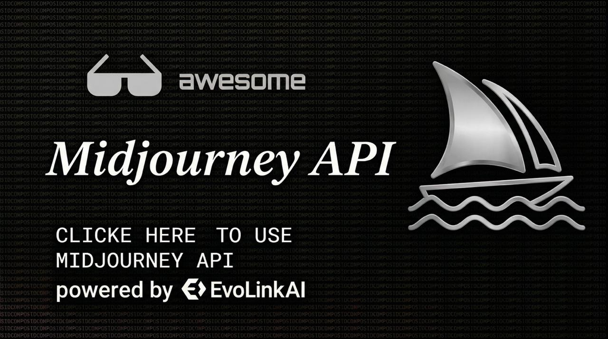

# Midjourney API: Preços, Documentação Oficial, Fluxos de Trabalho e Guia de Integração

<p align="center">
  <a href="./README.md">English</a> · <a href="./README.es.md">Español</a> · <a href="./README.pt.md">Português</a> · <a href="./README.ja.md">日本語</a> · <a href="./README.ko.md">한국어</a> · <a href="./README.de.md">Deutsch</a> · <a href="./README.fr.md">Français</a> · <a href="./README.tr.md">Türkçe</a> · <a href="./README.zh-TW.md">繁體中文</a> · <a href="./README.zh-CN.md">简体中文</a> · <a href="./README.ru.md">Русский</a>
</p>

<p align="center">
  <a href="https://evolink.ai/midjourney-v7?utm_source=github&utm_medium=banner&utm_campaign=midjourney-api">
    
  </a>
</p>

<p align="center">
  Compare os preços da Midjourney API, revise a documentação oficial do fluxo de trabalho do Midjourney V7 e integre a geração e edição de imagens através de uma API unificada.
</p>

## Início Rápido

Use a geração de imagens do Midjourney V7 em uma única chamada de API.

```bash
curl --request POST \
  --url https://api.evolink.ai/v1/images/generations \
  --header 'Authorization: Bearer YOUR_API_KEY' \
  --header 'Content-Type: application/json' \
  --data '{
    "model": "mj-v7",
    "prompt": "A cinematic shot of a Maine Coon cat on a neon-lit balcony --ar 16:9 --s 500",
    "model_params": {
      "speed": "fast"
    }
  }'
```

<p align="left">
  <a href="https://evolink.ai/midjourney-v7?utm_source=github&utm_medium=readme&utm_campaign=midjourney-api">Ver Preços da Midjourney API</a> ·
  <a href="https://evolink.ai/signup?utm_source=github&utm_medium=readme&utm_campaign=midjourney-api">Obter Chave de API</a> ·
  <a href="https://docs.evolink.ai/en/api-manual/image-series/midjourney/mj-v7-image-generate?utm_source=github&utm_medium=readme&utm_campaign=midjourney-api">Ler Documentação da API</a>
</p>

## O Que É a Midjourney API?

A Midjourney API no EvoLink.ai oferece aos desenvolvedores acesso aos fluxos de trabalho de geração e edição de imagens do Midjourney V7 por meio de uma chave de API unificada. Com base nas referências oficiais fornecidas para este repositório, as operações atualmente cobertas incluem: geração de imagens, imagem para imagem, fluxos de referência de estilo e objeto, upscale, inpaint, outpaint, pan, remix, retexture, canvas edit, enhance, remove background e upload paint.

Este repositório foi criado para desenvolvedores que desejam:

- entender os preços e o comportamento de cobrança da Midjourney API
- revisar a cobertura oficial dos fluxos de trabalho do Midjourney V7 em um só lugar
- escolher a operação correta do Midjourney para cada tarefa
- integrar a geração e edição do Midjourney em aplicações de produção

## Por Que Usar o EvoLink para a Midjourney API?

- uma chave de API para os fluxos de trabalho de geração e edição do Midjourney V7
- preços transparentes por solicitação para geração nos modos draft, fast e turbo
- fluxo de tarefas assíncrono projetado para integração em produção
- suporte para parâmetros de prompt nativos do Midjourney V7 e fluxos de referência
- suporte a callbacks HTTPS para fluxos de conclusão de tarefas
- posicionamento de 99,9% de uptime na página oficial do produto

## Preços da Midjourney API

Os preços abaixo seguem a referência do produto Midjourney V7 fornecida para este repositório.

| Modelo | Modo | Velocidade | Preço | Notas |
|---|---|---|---:|---|
| `mj-v7` | geração de imagens | draft | $0,040 / solicitação | aprox. 2,7 créditos, 4 imagens por solicitação |
| `mj-v7` | geração de imagens | fast | $0,079 / solicitação | modo padrão, aprox. 5,4 créditos |
| `mj-v7` | geração de imagens | turbo | $0,159 / solicitação | modo prioritário, aprox. 10,8 créditos |

> Cada solicitação produz 4 imagens. A moderação de conteúdo do Midjourney pode filtrar alguns resultados, portanto o resultado retornado pode conter de 1 a 4 imagens. A cobrança é por solicitação, não por imagem.

## Fluxos de Trabalho do Midjourney V7 Suportados

| Fluxo de Trabalho | Modelo | Resumo |
|---|---|---|
| Geração de Imagens | `mj-v7` | texto para imagem e imagem para imagem com sintaxe de prompt nativa do Midjourney V7 |
| Upscale | `mj-v7-upscale` | ampliar uma imagem selecionada de uma tarefa concluída |
| Inpaint | `mj-v7-inpaint` | editar uma área mascarada em uma imagem selecionada |
| Outpaint | `mj-v7-outpaint` | expandir além do limite original da imagem |
| Pan | `mj-v7-pan` | estender a composição em uma direção |
| Remix | `mj-v7-remix` | reinterpretar uma imagem existente com um novo prompt |
| Retexture | `mj-v7-retexture` | alterar textura ou estilo preservando a estrutura |
| Canvas Edit | `mj-v7-edit` | reposicionar a imagem na tela e preencher áreas em branco |
| Enhance | `mj-v7-enhance` | melhorar uma imagem gerada selecionada |
| Remove Background | `mj-v7-remove-bg` | gerar recorte transparente do sujeito a partir de uma imagem de entrada |
| Upload Paint | `mj-v7-upload-paint` | fluxo de edição avançada usando imagem enviada, máscara e configurações de tela |

## Documentos Oficiais da API

As referências detalhadas dos fluxos de trabalho estão em documentos separados para que o README permaneça focado em navegação, preços e orientação de integração. Cada página abaixo está alinhada com os materiais de referência oficiais fornecidos para este repositório.

- [Geração de Imagens](./docs/official-api/image-generation.md)
- [Imagem para Imagem e Referência](./docs/official-api/image-to-image-and-reference.md)
- [Parâmetros de Prompt](./docs/prompt-parameters.md)
- [Upscale](./docs/official-api/upscale.md)
- [Inpaint](./docs/official-api/inpaint.md)
- [Outpaint](./docs/official-api/outpaint.md)
- [Pan](./docs/official-api/pan.md)
- [Remix](./docs/official-api/remix.md)
- [Retexture](./docs/official-api/retexture.md)
- [Canvas Edit](./docs/official-api/canvas-edit.md)
- [Enhance](./docs/official-api/enhance.md)
- [Remove Background](./docs/official-api/remove-background.md)
- [Upload Paint](./docs/official-api/upload-paint.md)

## Visão Geral dos Parâmetros de Prompt

O Midjourney V7 suporta sintaxe de parâmetros nativos diretamente dentro do campo `prompt`.

| Parâmetro | Exemplo | Propósito |
|---|---|---|
| `--ar` | `--ar 16:9` | proporção de aspecto |
| `--s` | `--s 500` | intensidade de estilização |
| `--c` / `--chaos` | `--c 30` | diversidade de resultados |
| `--q` | `--q 2` | nível de qualidade |
| `--seed` | `--seed 12345` | exploração reproduzível |
| `--no` | `--no text, watermark` | excluir elementos |
| `--iw` | `--iw 1.5` | peso do prompt de imagem |
| `--sref` | `--sref https://...` | referência de estilo |
| `--oref` | `--oref https://...` | referência de objeto |
| `--raw` | `--raw` | reduzir embelezamento |
| `--tile` | `--tile` | geração de padrões contínuos |
| `--w` | `--w 500` | estranheza |
| `--exp` | `--exp 25` | estética experimental |

As regras detalhadas de parâmetros estão em [`docs/prompt-parameters.md`](./docs/prompt-parameters.md).

## Fluxo de Integração

1. obtenha uma chave de API no EvoLink.ai
2. crie uma tarefa de geração ou edição com `POST /v1/images/generations`
3. armazene o ID da tarefa retornado
4. consulte `GET /v1/tasks/{task_id}` até que a tarefa seja concluída
5. baixe e salve as imagens resultantes rapidamente porque os links gerados são temporários

## Exemplos de Código

- [cURL: geração básica](./examples/curl/generate-image.sh)
- [cURL: imagem para imagem](./examples/curl/image-to-image.sh)
- [cURL: upscale](./examples/curl/upscale.sh)
- [cURL: inpaint](./examples/curl/inpaint.sh)
- [JavaScript: geração básica](./examples/javascript/basic.mjs)
- [JavaScript: imagem para imagem](./examples/javascript/image-to-image.mjs)
- [JavaScript: upscale](./examples/javascript/upscale.mjs)
- [JavaScript: inpaint](./examples/javascript/inpaint.mjs)

## Comparação de Fluxos de Trabalho

| Se você precisar... | Fluxo recomendado | Por quê |
|---|---|---|
| geração inicial | `mj-v7` | geração de imagens nativa V7 |
| usar uma ou mais imagens de referência no prompt | `mj-v7` | suporta URLs de imagens no início do prompt |
| alterar apenas uma área local selecionada | `mj-v7-inpaint` | edição baseada em máscara |
| expandir a composição para fora | `mj-v7-outpaint` | enquadramento mais amplo além da imagem original |
| estender à esquerda, direita, cima ou baixo | `mj-v7-pan` | extensão direcional |
| reinterpretar um resultado com um novo prompt | `mj-v7-remix` | variação baseada em prompt a partir de uma tarefa existente |
| preservar o layout mas alterar material ou acabamento | `mj-v7-retexture` | transformação de estilo e textura a partir de uma imagem de entrada |
| recortar o sujeito de uma imagem | `mj-v7-remove-bg` | sem prompt necessário |
| reposicionar uma imagem em uma tela maior | `mj-v7-edit` | expansão de tela com controle de posicionamento |

## Notas de Produção

- todos os endpoints requerem autenticação com token Bearer
- os fluxos de trabalho de geração e edição do Midjourney são assíncronos
- os callbacks devem usar HTTPS e não podem apontar para endereços IP privados
- o tempo limite do callback é de 10 segundos com até 3 tentativas
- os links de imagens geradas são válidos por 24 horas, salve-os rapidamente
- `--v`, `--version` e `--niji` não são suportados em solicitações V7 aqui
- `--fast`, `--draft` e `--turbo` não devem ser escritos no prompt, use `model_params.speed`
- os fluxos de trabalho de edição geralmente requerem um ID de tarefa concluída e o número da imagem selecionada
- remove background não usa parâmetros de prompt ou velocidade
- retexture e remove background aceitam URLs de imagens de entrada diretamente, sem depender de uma tarefa de origem

## Perguntas Frequentes

### Como a Midjourney API é cobrada?
A geração do Midjourney V7 é cobrada por solicitação, não por imagem. Uma solicitação visa 4 resultados, mas a filtragem de moderação pode reduzir o número de imagens retornadas.

### Como faço imagem para imagem?
Coloque uma ou mais URLs de imagens no início do `prompt`, depois adicione sua descrição de texto e os parâmetros do Midjourney.

### Por que os endpoints de edição precisam de um ID de tarefa?
Operações como upscale, inpaint, outpaint, pan, enhance e remix funcionam em uma imagem selecionada de uma tarefa concluída, portanto requerem a referência da tarefa original.

### Posso usar `--turbo` ou `--draft` no prompt?
Não. A velocidade é controlada através de `model_params.speed`.

## Links Relacionados

- [Página do Produto Midjourney V7](https://evolink.ai/midjourney-v7?utm_source=github&utm_medium=readme&utm_campaign=midjourney-api)
- [Obter Chave de API](https://evolink.ai/signup?utm_source=github&utm_medium=readme&utm_campaign=midjourney-api)
- [Documentação da Midjourney API](https://docs.evolink.ai/en/api-manual/image-series/midjourney/mj-v7-image-generate?utm_source=github&utm_medium=readme&utm_campaign=midjourney-api)

## Nota do Repositório

Este repositório é um hub de documentação e exemplos para o uso da Midjourney API no EvoLink.ai. Os materiais oficiais detalhados dos fluxos de trabalho estão organizados em `docs/official-api/`, enquanto `mjv7参考/` permanece como material de referência local e está excluído dos uploads através do `.gitignore`.
